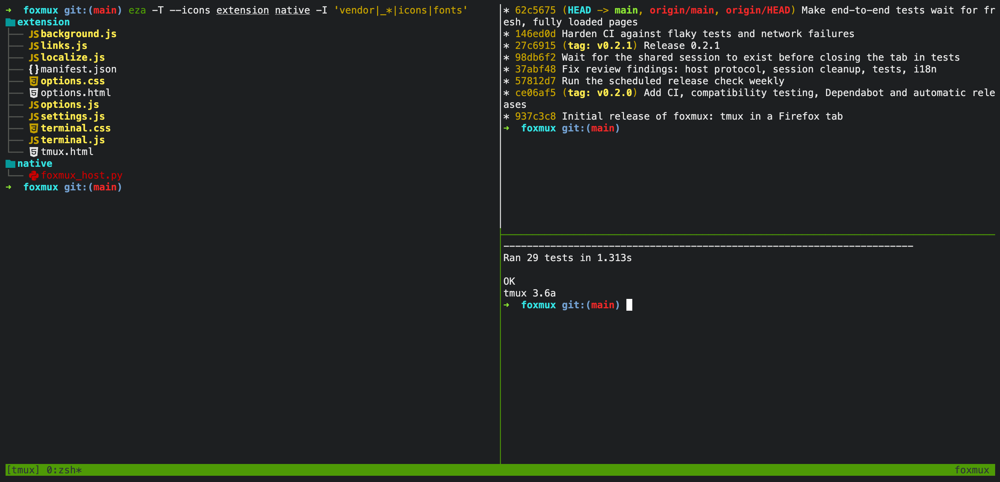
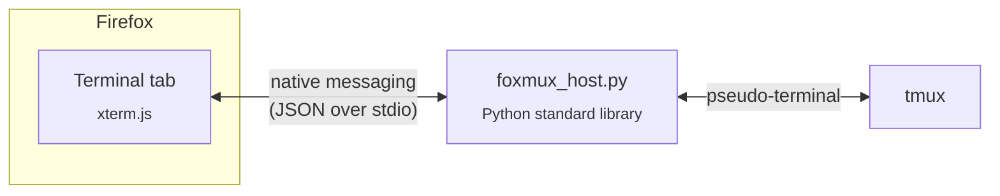

<div align="center">


# foxmux

**A real tmux terminal in a Firefox tab.**

[](https://github.com/tomoliveri/foxmux/actions/workflows/ci.yml)
[](https://github.com/tomoliveri/foxmux/actions/workflows/compat.yml)
[](https://github.com/tomoliveri/foxmux/releases/latest)
[](https://www.mozilla.org/firefox/)
[](LICENSE)

[Install](#install) · [Settings](#settings) · [How it works](#how-it-works) · [Security](#security) · [Report an issue](https://github.com/tomoliveri/foxmux/issues/new)

<br>



</div>

## Why foxmux

- **Real tmux, not an imitation.** Every tab runs a genuine `tmux` client in a
  pseudo-terminal on your machine. Your config, key bindings, splits,
  sessions and plugins all just work.
- **One click or one shortcut.** The toolbar button or <kbd>Alt</kbd>+<kbd>Shift</kbd>+<kbd>T</kbd>
  opens a terminal tab, starting in `~` or any folder you choose.
- **Looks right out of the box.** Colours, mouse, resizing, copy and paste, plus
  a bundled Nerd Fonts symbol font, so icons from `eza`, starship and powerline
  prompts render with no setup.
- **Keeps itself current.** Signed by Mozilla and updated automatically, and
  tested every week against upcoming Firefox and tmux versions.
- **Small and easy to audit.** Under 700 lines of extension and host code. The
  host is plain Python with nothing extra to install.

## Install

**You need:** Firefox 128 or newer, tmux, Python 3.9 or newer, and macOS or
Linux.

1. **Add the extension.** Open
   [`foxmux-<version>-signed.xpi`](https://github.com/tomoliveri/foxmux/releases/latest)
   from the latest release in Firefox and click _Add_.
2. **Install the native host.** From the same release, download
   `foxmux-host-<version>.tar.gz`, unpack it and run:

   ```sh
   ./install.sh        # ./install.sh --uninstall removes it
   ```

That's it. Click the fox in the toolbar.

> [!NOTE]
> Firefox updates the extension by itself. The native host only changes
> rarely; when it does, the release notes say so and the tab tells you to
> re-run `./install.sh`.

<details>
<summary><b>Install from source</b></summary>

```sh
git clone https://github.com/tomoliveri/foxmux.git && cd foxmux
npm ci --ignore-scripts && npm run vendor
./install.sh
```

Then open `about:debugging#/runtime/this-firefox`, choose _Load Temporary
Add-on…_ and pick `extension/manifest.json`. Temporary add-ons are removed
when Firefox restarts.

</details>

## Settings

Open `about:addons` → **foxmux** → **Preferences**.

| Setting               | Default             | What it does                                                                                           |
| --------------------- | ------------------- | ------------------------------------------------------------------------------------------------------ |
| **Start directory**   | `~`                 | Where new sessions start. `~` and `$VARS` are expanded; falls back to `~` if the folder is missing.    |
| **Sessions**          | New session per tab | Per-tab sessions end when the tab closes. _Shared_ attaches every tab to one named session that stays. |
| **Font size, family** | 14, Menlo…          | Any installed monospace font. Icons always come from the bundled symbols font.                         |
| **Option as Meta**    | Off                 | macOS: make <kbd>Option</kbd> act as Meta instead of typing special characters.                        |

## Tips

- Firefox keeps a few shortcuts for itself, such as <kbd>Cmd</kbd>+<kbd>T</kbd>,
  <kbd>Cmd</kbd>+<kbd>W</kbd> and <kbd>Ctrl</kbd>+<kbd>Tab</kbd>. tmux's usual
  <kbd>Ctrl</kbd>+<kbd>b</kbd> prefix is unaffected.
- Scrollback lives in tmux: use `prefix [`, or `set -g mouse on` to scroll with
  the wheel.
- With tmux's mouse mode on, hold <kbd>Option</kbd> while dragging to select
  text for the browser's clipboard.
- When tmux exits or you detach, press <kbd>Enter</kbd> in the tab to reconnect.

## How it works

Browser extensions can't start programs, so foxmux comes in two halves joined
by Firefox's
[native messaging](https://developer.mozilla.org/docs/Mozilla/Add-ons/WebExtensions/Native_messaging).



- **The extension** draws the terminal with
  [xterm.js](https://xtermjs.org/) and sends your keystrokes to the host.
- **The native host** (`native/foxmux_host.py`) runs `tmux new-session -A` in a
  pseudo-terminal, relays bytes both ways, and lives exactly as long as the tab.
- Both sides check a protocol version, so a mismatched host is caught and
  explained instead of misbehaving.

## Security

foxmux gives a browser tab the same power as a terminal window: whatever runs
in it runs as you. The design keeps that power away from the web.

| Protection                        | How                                                                                                       |
| --------------------------------- | --------------------------------------------------------------------------------------------------------- |
| Only foxmux can start the host    | Firefox only lets the extension ID `foxmux@foxmux` connect; web pages can't use native messaging.         |
| Websites can't reach the terminal | The page isn't web-accessible, and the extension has no content scripts and talks to no server.           |
| No injected code                  | Firefox's Manifest V3 security policy allows only the extension's own scripts: no `eval`, no remote code. |
| No shell injection                | The host starts tmux directly with plain arguments, never through a shell, and never opens a port.        |
| Terminal output can't attack you  | Links printed in the terminal open only if they are `http` or `https`, in a new tab.                      |

The remaining risks are those of any terminal: the programs you run, and other
software already running as you. Found a vulnerability? Please
[report it privately](https://github.com/tomoliveri/foxmux/security/advisories/new)
(see [`SECURITY.md`](SECURITY.md)).

## Development

```sh
npm ci --ignore-scripts             # dependencies, pinned by package-lock.json
npm run lint                        # Prettier, ESLint (Mozilla's rules), Mozilla's add-on linter
ruff format native test && ruff check native test
npm test                            # unit tests, plus host tests against real tmux
npm run build && npm run test:e2e   # end-to-end tests in a real Firefox
```

`extension/vendor/` is generated from npm by `npm run vendor`. The host and
end-to-end tests need tmux; the end-to-end tests also need the native host
installed (`./install.sh`). Set `FIREFOX_BIN` to choose a Firefox.

User-facing text lives in `extension/_locales/`. The native host sends message
codes rather than text, so everything shown in the tab can be translated.

<details>
<summary><b>Automation: CI, compatibility, Dependabot and releases</b></summary>

- **CI** lints, audits shipped dependencies and runs the unit, host and
  end-to-end tests on Linux (packaged and latest tmux) and macOS for every push
  and pull request. Network steps retry, and tests wait generously for slow
  machines.
- **Compatibility** runs weekly against Firefox release, beta, nightly and ESR
  with tmux's latest release and development branch. It also repeats the whole
  suite five times to catch flaky tests, flags new Nerd Fonts releases, and
  opens an issue if anything breaks.
- **Dependabot** keeps npm packages, GitHub Actions and Ruff current. Patch and
  minor updates merge automatically once CI passes, after a three-day cooldown.
- **Release** signs a new version through addons.mozilla.org (unlisted) and
  publishes it on GitHub whenever shipped files change; installed copies pick it
  up through `update_url`. `scripts/release-version.sh` picks the number: the
  next patch version, or the manifest's version if you raised it for a bigger
  release. The release commits that version to `main`, so each tag holds
  exactly what shipped.
- **Secrets:** signing uses the `AMO_JWT_ISSUER` and `AMO_JWT_SECRET`
  repository secrets (or a git-ignored `.amo-credentials` file for
  `scripts/sign.sh` locally). The version commit uses the `RELEASE_DEPLOY_KEY`
  deploy key, the only actor besides admins that may push to `main` without the
  CI check. Anyone holding the AMO key can sign add-ons as you, so keep it
  private.

</details>

## Licence

foxmux makes no copyright or licence claim of its own. Its source is offered
under the [Mozilla Public License 2.0](LICENSE), Firefox's licence. tmux's ISC
licence and the licences of the bundled xterm.js files and Nerd Fonts symbols
font are in [`licenses/`](licenses). See [`NOTICE.md`](NOTICE.md) for details
and trademark notes.

<div align="center">
<sub>Firefox is a trademark of the Mozilla Foundation. foxmux is an independent project, not affiliated with or endorsed by Mozilla or tmux.</sub>
</div>
